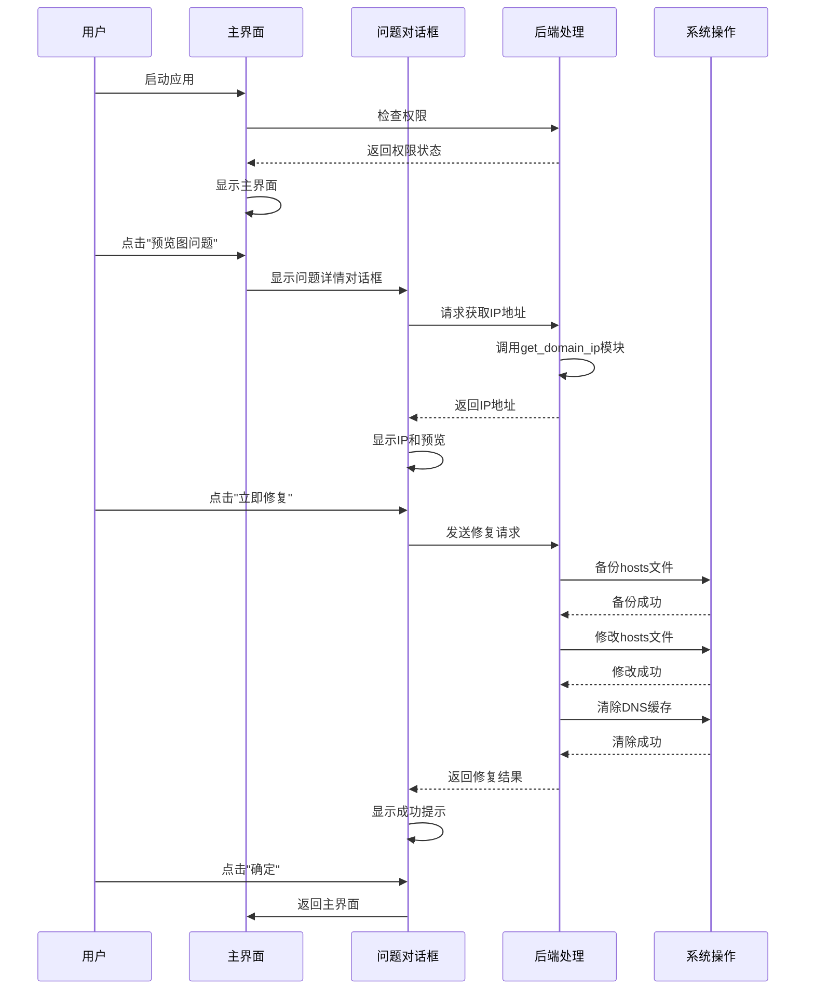
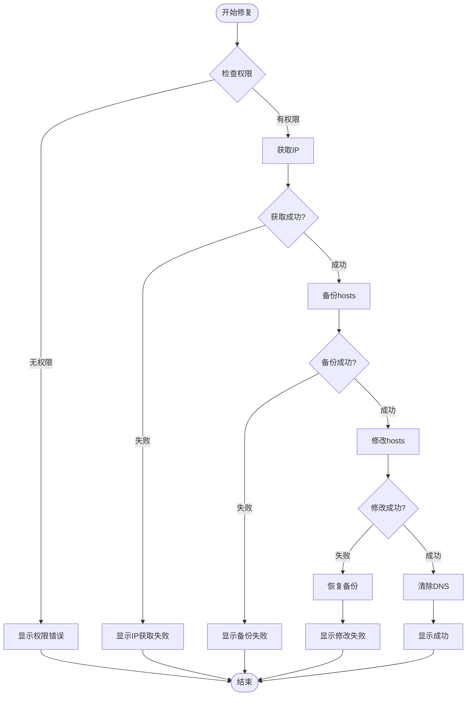

# 千图网问题解决工具 - UI原型设计

## 方案一：PyQt6 详细UI设计

### 1. 主界面设计

```
╔══════════════════════════════════════════════════════════════╗
║  🎨 千图网问题解决工具 v1.0          [⚙️ 设置] [−] [×]      ║
╠══════════════════════════════════════════════════════════════╣
║                                                              ║
║  ┌────────────────────────────────────────────────────┐     ║
║  │  🔍 搜索问题或输入域名...                          │     ║
║  └────────────────────────────────────────────────────┘     ║
║                                                              ║
║  📋 常见问题快速修复                                         ║
║  ┌────────────────────────────────────────────────────┐     ║
║  │                                                      │     ║
║  │  ┌──────────────────┐  ┌──────────────────┐        │     ║
║  │  │ 🖼️ 预览图问题     │  │ 🎨 样式问题      │        │     ║
║  │  │ 无法显示/加载慢   │  │ 页面样式异常     │        │     ║
║  │  │                  │  │                  │        │     ║
║  │  │ [一键修复]        │  │ [一键修复]        │        │     ║
║  │  └──────────────────┘  └──────────────────┘        │     ║
║  │                                                      │     ║
║  │  ┌──────────────────┐  ┌──────────────────┐        │     ║
║  │  │ ⬇️ 下载问题        │  │ ☁️ 云设计问题     │        │     ║
║  │  │ 无法访问/失败     │  │ 首页无法访问     │        │     ║
║  │  │                  │  │                  │        │     ║
║  │  │ [一键修复]        │  │ [一键修复]        │        │     ║
║  │  └──────────────────┘  └──────────────────┘        │     ║
║  │                                                      │     ║
║  │  ┌──────────────────┐  ┌──────────────────┐        │     ║
║  │  │ 📦 卡片加载异常    │  │ ⚠️ 下载失败       │        │     ║
║  │  │ 显示标签但无内容   │  │ 网络错误/中断    │        │     ║
║  │  │                  │  │                  │        │     ║
║  │  │ [一键修复]        │  │ [一键修复]        │        │     ║
║  │  └──────────────────┘  └──────────────────┘        │     ║
║  │                                                      │     ║
║  └────────────────────────────────────────────────────┘     ║
║                                                              ║
║  🔧 工具箱                                                   ║
║  ┌────────────────────────────────────────────────────┐     ║
║  │  [📋 检查Hosts配置]  [🧹 清除浏览器缓存]            │     ║
║  │  [🔄 清除DNS缓存]     [🌐 检查浏览器版本]            │     ║
║  │  [🔍 诊断下载问题]                                  │     ║
║  └────────────────────────────────────────────────────┘     ║
║                                                              ║
║  ┌────────────────────────────────────────────────────┐     ║
║  │  📊 系统状态                                         │     ║
║  │  系统: macOS 14.0  |  权限: ✓ 已获取管理员权限      │     ║
║  │  Hosts文件: /etc/hosts  |  已绑定域名: 2个          │     ║
║  └────────────────────────────────────────────────────┘     ║
╚══════════════════════════════════════════════════════════════╝
```

### 2. 问题修复对话框

```
╔══════════════════════════════════════════════════════════════╗
║  修复问题: 主站卡片预览图无法显示、加载慢            [×]      ║
╠══════════════════════════════════════════════════════════════╣
║                                                              ║
║  📋 问题描述                                                 ║
║  ┌────────────────────────────────────────────────────┐     ║
║  │  主站卡片预览图无法显示或加载缓慢，影响用户体验。   │     ║
║  │  通常是由于CDN节点访问异常导致的。                 │     ║
║  └────────────────────────────────────────────────────┘     ║
║                                                              ║
║  🔧 解决方案                                                 ║
║  ┌────────────────────────────────────────────────────┐     ║
║  │  需要绑定域名: preview.qiantucdn.com              │     ║
║  │  到最优IP地址，以加速访问。                         │     ║
║  └────────────────────────────────────────────────────┘     ║
║                                                              ║
║  🌐 正在获取IP地址...                                        ║
║  ┌────────────────────────────────────────────────────┐     ║
║  │  [████████████████░░░░]  80%                        │     ║
║  │  正在从 17ce.com 获取最优IP...                      │     ║
║  └────────────────────────────────────────────────────┘     ║
║                                                              ║
║  ✓ 已获取IP地址: 124.166.238.87                             ║
║  📍 节点位置: 北京 | 延迟: 12ms                              ║
║                                                              ║
║  ⚠️  重要提示                                                ║
║  ┌────────────────────────────────────────────────────┐     ║
║  │  • 此操作需要管理员权限                              │     ║
║  │  • 将自动备份当前hosts文件                          │     ║
║  │  • 修复后需要刷新浏览器才能生效                      │     ║
║  └────────────────────────────────────────────────────┘     ║
║                                                              ║
║              [预览修改]  [立即修复]  [取消]                  ║
╚══════════════════════════════════════════════════════════════╝
```

### 3. 修复过程窗口

```
╔══════════════════════════════════════════════════════════════╗
║  正在修复问题...                                    [最小化]  ║
╠══════════════════════════════════════════════════════════════╣
║                                                              ║
║                    ⏳ 正在处理中...                         ║
║                                                              ║
║  ┌────────────────────────────────────────────────────┐     ║
║  │                                                      │     ║
║  │  ✓ 步骤 1/4: 获取域名IP地址                          │     ║
║  │     └─ 已获取: 124.166.238.87                        │     ║
║  │                                                      │     ║
║  │  ✓ 步骤 2/4: 备份hosts文件                           │     ║
║  │     └─ 备份位置: /etc/hosts.backup.20260122_143025  │     ║
║  │                                                      │     ║
║  │  ⏳ 步骤 3/4: 修改hosts文件                          │     ║
║  │     └─ 正在写入配置...                               │     ║
║  │                                                      │     ║
║  │  ⏸ 步骤 4/4: 清除DNS缓存                            │     ║
║  │     └─ 等待中...                                     │     ║
║  │                                                      │     ║
║  └────────────────────────────────────────────────────┘     ║
║                                                              ║
║  总体进度: [████████████████░░░░] 75%                       ║
║                                                              ║
║  [取消操作]                                                  ║
╚══════════════════════════════════════════════════════════════╝
```

### 4. Hosts配置查看窗口

```
╔══════════════════════════════════════════════════════════════╗
║  Hosts配置管理                                    [刷新] [×]  ║
╠══════════════════════════════════════════════════════════════╣
║                                                              ║
║  📋 当前已绑定的千图相关域名                                 ║
║  ┌────────────────────────────────────────────────────┐     ║
║  │ 域名                    IP地址          状态  操作 │     ║
║  ├────────────────────────────────────────────────────┤     ║
║  │ preview.qiantucdn.com   124.166.238.87  ✓  [解绑] │     ║
║  │ js.qiantucdn.com        未绑定          -  [绑定] │     ║
║  │ icon.qiantucdn.com      未绑定          -  [绑定] │     ║
║  │ dl.58pic.com            47.104.5.133    ✓  [解绑] │     ║
║  │ y.58pic.com             未绑定          -  [绑定] │     ║
║  │ proxy-rar.58pic.com     未绑定          -  [绑定] │     ║
║  │ proxy-vip.58pic.com     未绑定          -  [绑定] │     ║
║  │ proxy-vd.58pic.com      未绑定          -  [绑定] │     ║
║  └────────────────────────────────────────────────────┘     ║
║                                                              ║
║  📊 统计信息                                                 ║
║  • 已绑定: 2个域名                                           ║
║  • 未绑定: 6个域名                                           ║
║  • Hosts文件: /etc/hosts                                     ║
║                                                              ║
║  [导出配置]  [一键解绑所有]  [关闭]                          ║
╚══════════════════════════════════════════════════════════════╝
```

### 5. 成功/失败提示

```
╔══════════════════════════════════════════════════════════════╗
║  ✓ 修复成功！                                        [确定]  ║
╠══════════════════════════════════════════════════════════════╣
║                                                              ║
║                    ✅ 问题已成功修复                         ║
║                                                              ║
║  📋 修复内容:                                                ║
║  • 已绑定域名: preview.qiantucdn.com                        ║
║  • IP地址: 124.166.238.87                                    ║
║  • 已清除DNS缓存                                             ║
║                                                              ║
║  💡 下一步操作:                                               ║
║  1. 请刷新浏览器或重启浏览器                                ║
║  2. 如果问题仍然存在，请检查网络连接                         ║
║  3. 可以点击"检查配置"查看hosts文件状态                     ║
║                                                              ║
║  [检查配置]  [返回主页]  [关闭]                               ║
╚══════════════════════════════════════════════════════════════╝
```

---

## 方案二：Electron 现代化UI设计

### 1. 主界面（卡片式布局）

```
┌─────────────────────────────────────────────────────────────┐
│  🎨 千图网问题解决工具                    [⚙️] [−] [×]        │
├─────────────────────────────────────────────────────────────┤
│                                                              │
│  ┌──────────────────────────────────────────────────────┐ │
│  │  🔍 搜索问题...                                        │ │
│  └──────────────────────────────────────────────────────┘ │
│                                                              │
│  ⚡ 快速修复                                                 │
│  ┌──────────────┐ ┌──────────────┐ ┌──────────────┐      │
│  │ 🖼️            │ │ 🎨            │ │ ⬇️            │      │
│  │ 预览图问题    │ │ 样式问题      │ │ 下载问题      │      │
│  │              │ │              │ │              │      │
│  │ [修复]        │ │ [修复]        │ │ [修复]        │      │
│  └──────────────┘ └──────────────┘ └──────────────┘      │
│                                                              │
│  ┌──────────────┐ ┌──────────────┐ ┌──────────────┐      │
│  │ ☁️            │ │ 📦            │ │ ⚠️            │      │
│  │ 云设计问题    │ │ 卡片异常      │ │ 下载失败      │      │
│  │              │ │              │ │              │      │
│  │ [修复]        │ │ [修复]        │ │ [修复]        │      │
│  └──────────────┘ └──────────────┘ └──────────────┘      │
│                                                              │
│  ┌──────────────────────────────────────────────────────┐ │
│  │  🔧 工具箱                                             │ │
│  │  [📋] [🧹] [🔄] [🌐] [🔍]                              │ │
│  └──────────────────────────────────────────────────────┘ │
│                                                              │
│  ┌──────────────────────────────────────────────────────┐ │
│  │  📊 系统: macOS | 权限: ✓ | 已绑定: 2个域名            │ │
│  └──────────────────────────────────────────────────────┘ │
└─────────────────────────────────────────────────────────────┘
```

### 2. 修复动画效果

```
┌─────────────────────────────────────────────────────────────┐
│  正在修复...                                        [取消]   │
├─────────────────────────────────────────────────────────────┤
│                                                              │
│              ⏳                                              │
│                                                              │
│  ┌──────────────────────────────────────────────────────┐ │
│  │                                                      │ │
│  │  ✓ 获取IP地址                                        │ │
│  │  ✓ 备份hosts文件                                     │ │
│  │  ⏳ 修改hosts文件                                    │ │
│  │  ⏸ 清除DNS缓存                                      │ │
│  │                                                      │ │
│  └──────────────────────────────────────────────────────┘ │
│                                                              │
│  [████████████████░░░░] 75%                                 │
│                                                              │
└─────────────────────────────────────────────────────────────┘
```

---

## 交互流程详细设计

### 完整用户操作流程



### 错误处理流程



---

## UI组件设计规范

### 颜色方案

- **主色调**: 蓝色 (#1890FF) - 主要操作按钮
- **成功色**: 绿色 (#52C41A) - 成功提示
- **警告色**: 橙色 (#FA8C16) - 警告提示
- **错误色**: 红色 (#F5222D) - 错误提示
- **背景色**: 浅灰 (#F5F5F5) - 主背景
- **卡片色**: 白色 (#FFFFFF) - 卡片背景

### 字体规范

- **标题**: 18px, 粗体
- **正文**: 14px, 常规
- **提示文字**: 12px, 浅色
- **按钮文字**: 14px, 中等粗细

### 按钮样式

- **主要按钮**: 蓝色背景，白色文字，圆角4px
- **次要按钮**: 白色背景，蓝色边框，蓝色文字
- **危险按钮**: 红色背景，白色文字
- **禁用状态**: 灰色背景，灰色文字，不可点击

---

## 响应式设计

### 窗口尺寸

- **最小尺寸**: 800x600
- **推荐尺寸**: 1000x700
- **最大尺寸**: 1200x800

### 布局适配

- 小窗口: 单列布局，卡片堆叠
- 中等窗口: 双列布局，卡片并排
- 大窗口: 三列布局，更多信息展示

---

## 下一步

1. **选择方案**: 确定使用PyQt6还是Electron
2. **UI细化**: 创建详细的UI设计稿
3. **原型开发**: 创建可交互的原型
4. **开发实施**: 开始编码实现
