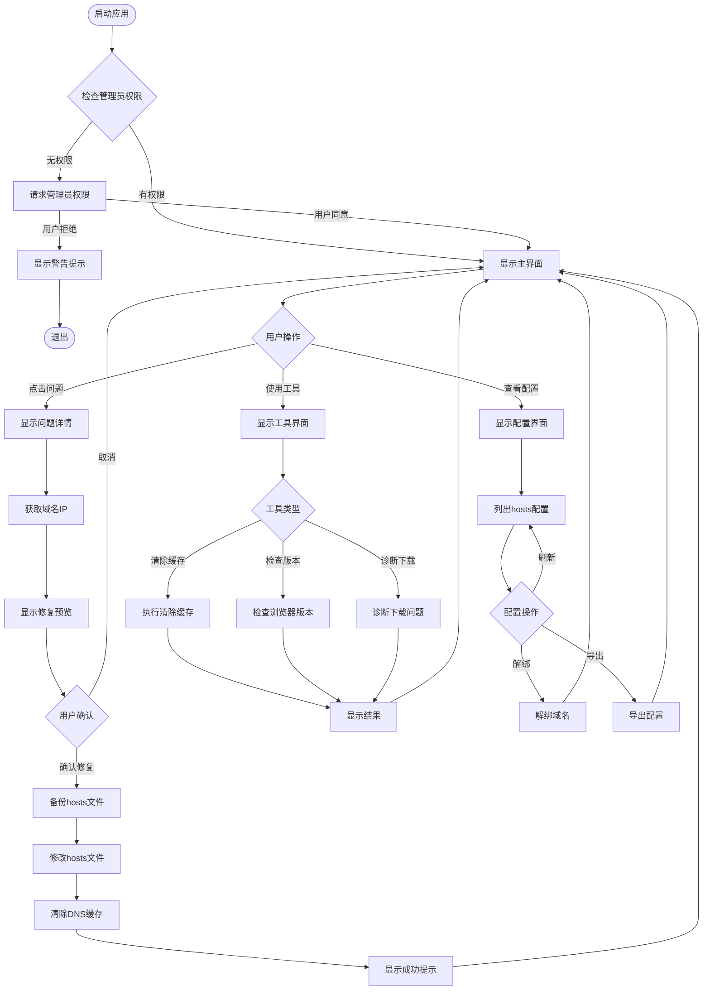
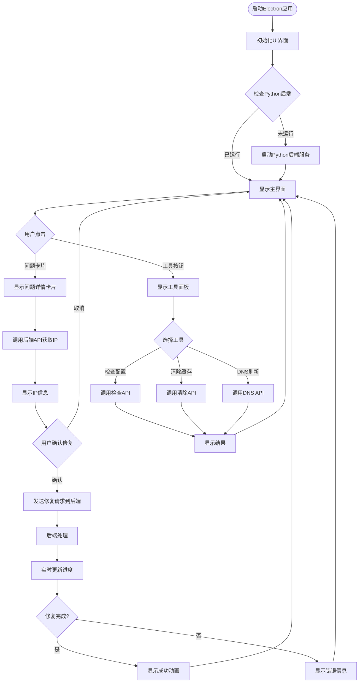
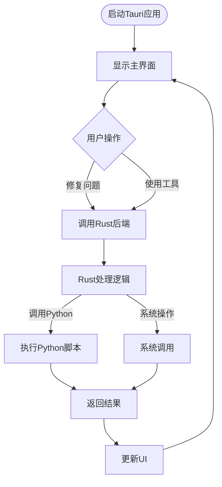
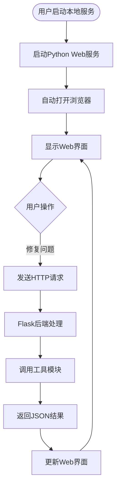

# 千图网问题解决工具 - UI设计方案

## 方案概览

基于现有脚本工具，提供3个可视化软件方案，每个方案都有不同的技术栈和适用场景。

---

## 方案一：PyQt6 桌面应用（推荐）

### 技术栈
- **前端框架**: PyQt6 / PySide6
- **语言**: Python
- **打包工具**: PyInstaller / cx_Freeze
- **优势**: 原生体验、性能好、可复用现有Python代码

### UI设计思路

#### 主界面布局
```
┌─────────────────────────────────────────────────┐
│  千图网问题解决工具                    [最小化][关闭]│
├─────────────────────────────────────────────────┤
│  [Logo/图标]                                     │
│                                                  │
│  ┌──────────────────────────────────────────┐   │
│  │  常见问题快速修复                          │   │
│  ├──────────────────────────────────────────┤   │
│  │  [🔍] 搜索问题...                         │   │
│  ├──────────────────────────────────────────┤   │
│  │  ⚡ 主站卡片预览图无法显示、加载慢          │   │
│  │  ⚡ 下载页面样式乱了                       │   │
│  │  ⚡ 主站样式丢了                           │   │
│  │  ⚡ 下载页面显示无法访问网站               │   │
│  │  ⚡ 云设计首页显示无法访问                 │   │
│  │  ⚡ 千图首页面卡片无法加载但显示标签       │   │
│  │  ⚡ 下载失败-网络错误、下载中断            │   │
│  └──────────────────────────────────────────┘   │
│                                                  │
│  ┌──────────────────────────────────────────┐   │
│  │  工具与诊断                                │   │
│  ├──────────────────────────────────────────┤   │
│  │  [检查Hosts配置]  [清除浏览器缓存]         │   │
│  │  [清除DNS缓存]    [检查浏览器版本]         │   │
│  │  [诊断下载问题]                           │   │
│  └──────────────────────────────────────────┘   │
│                                                  │
│  ┌──────────────────────────────────────────┐   │
│  │  状态栏                                    │   │
│  │  系统: macOS | 权限: ✓ 已获取 | 版本: 1.0 │   │
│  └──────────────────────────────────────────┘   │
└─────────────────────────────────────────────────┘
```

#### 问题修复对话框
```
┌─────────────────────────────────────────────┐
│  修复: 主站卡片预览图无法显示              [×]│
├─────────────────────────────────────────────┤
│                                              │
│  📋 问题描述:                                │
│  主站卡片预览图无法显示或加载缓慢           │
│                                              │
│  🔧 解决方案:                                │
│  需要绑定域名: preview.qiantucdn.com        │
│                                              │
│  🌐 正在获取IP地址...                        │
│  [████████████░░░░] 60%                     │
│                                              │
│  ✓ 已获取IP: 124.166.238.87                 │
│                                              │
│  ⚠️  需要管理员权限修改hosts文件             │
│                                              │
│  [预览修改]  [立即修复]  [取消]              │
└─────────────────────────────────────────────┘
```

#### Hosts配置查看窗口
```
┌─────────────────────────────────────────────┐
│  Hosts配置检查                              [×]│
├─────────────────────────────────────────────┤
│                                              │
│  已绑定的千图相关域名:                       │
│                                              │
│  ┌──────────────────────────────────────┐  │
│  │ 域名                IP地址      行号   │  │
│  ├──────────────────────────────────────┤  │
│  │ preview.qiantucdn.com  124.166...  45│  │
│  │ js.qiantucdn.com       未绑定        │  │
│  │ icon.qiantucdn.com     未绑定        │  │
│  └──────────────────────────────────────┘  │
│                                              │
│  [刷新]  [导出配置]  [一键解绑]  [关闭]      │
└─────────────────────────────────────────────┘
```

### 交互流程图



### 优点
- ✅ 原生桌面应用，性能好
- ✅ 可完全复用现有Python代码
- ✅ 界面美观，支持现代化设计
- ✅ 跨平台（Windows/Mac/Linux）
- ✅ 打包后单文件，用户无需安装Python

### 缺点
- ❌ 打包后文件较大（50-100MB）
- ❌ 需要处理不同操作系统的权限问题
- ❌ UI开发需要学习PyQt

### 开发难度
⭐⭐⭐ 中等（3-5天）

---

## 方案二：Electron 桌面应用

### 技术栈
- **前端框架**: React / Vue + Electron
- **语言**: JavaScript/TypeScript + Python后端
- **打包工具**: electron-builder
- **优势**: Web技术栈、界面灵活、跨平台

### UI设计思路

#### 主界面（现代化卡片式设计）
```
┌─────────────────────────────────────────────────┐
│  🎨 千图网问题解决工具              [⚙️][-][×]    │
├─────────────────────────────────────────────────┤
│                                                  │
│  ┌──────────┐  ┌──────────┐  ┌──────────┐      │
│  │ 预览图    │  │ 样式问题 │  │ 下载问题 │      │
│  │ 无法显示  │  │ 页面样式 │  │ 无法访问 │      │
│  │ [一键修复]│  │ [一键修复]│  │ [一键修复]│      │
│  └──────────┘  └──────────┘  └──────────┘      │
│                                                  │
│  ┌──────────┐  ┌──────────┐  ┌──────────┐      │
│  │ 云设计    │  │ 卡片加载 │  │ 下载失败 │      │
│  │ 无法访问  │  │ 异常     │  │ 网络错误 │      │
│  │ [一键修复]│  │ [一键修复]│  │ [一键修复]│      │
│  └──────────┘  └──────────┘  └──────────┘      │
│                                                  │
│  ┌──────────────────────────────────────────┐  │
│  │  🔧 工具箱                                 │  │
│  │  [检查配置] [清除缓存] [DNS刷新] [版本检查]│  │
│  └──────────────────────────────────────────┘  │
│                                                  │
│  📊 当前状态: ✓ 已获取权限 | 🌐 系统: macOS    │
└─────────────────────────────────────────────────┘
```

#### 修复过程动画
```
┌─────────────────────────────────────────────┐
│  正在修复问题...                           │
├─────────────────────────────────────────────┤
│                                              │
│         [旋转动画]                          │
│                                              │
│  ⏳ 步骤 1/4: 获取域名IP地址                │
│  ✓ 步骤 2/4: 备份hosts文件                 │
│  ⏳ 步骤 3/4: 修改hosts文件                │
│  ⏸ 步骤 4/4: 清除DNS缓存                   │
│                                              │
│  [████████████░░░░] 60%                     │
│                                              │
└─────────────────────────────────────────────┘
```

### 交互流程图



### 架构设计

```
┌─────────────────────────────────┐
│   Electron前端 (React/Vue)      │
│   - UI界面                      │
│   - 用户交互                    │
│   - 状态管理                    │
└──────────┬──────────────────────┘
            │ IPC通信
            ▼
┌─────────────────────────────────┐
│   Python后端服务 (Flask/FastAPI) │
│   - 调用现有工具模块            │
│   - 处理系统操作                │
│   - 权限管理                    │
└─────────────────────────────────┘
```

### 优点
- ✅ 现代化Web UI，界面美观
- ✅ 开发效率高，组件化开发
- ✅ 跨平台，一套代码多端运行
- ✅ 丰富的UI库和组件

### 缺点
- ❌ 应用体积大（100-200MB）
- ❌ 需要维护前后端两套代码
- ❌ 内存占用较高
- ❌ 需要处理IPC通信

### 开发难度
⭐⭐⭐⭐ 较高（5-7天）

---

## 方案三：Tauri 桌面应用（轻量级）

### 技术栈
- **前端框架**: React / Vue / Svelte
- **后端**: Rust
- **语言**: TypeScript + Rust
- **打包工具**: Tauri CLI
- **优势**: 体积小、性能好、安全性高

### UI设计思路

与Electron类似，但应用体积更小（10-30MB）

### 交互流程图



### 优点
- ✅ 应用体积小（10-30MB）
- ✅ 性能好，接近原生
- ✅ 安全性高
- ✅ 内存占用低

### 缺点
- ❌ 需要学习Rust
- ❌ 开发周期较长
- ❌ 生态相对较新

### 开发难度
⭐⭐⭐⭐⭐ 很高（7-10天）

---

## 方案四：Web应用 + 本地代理（混合方案）

### 技术栈
- **前端**: React / Vue（Web界面）
- **后端**: Python Flask + 本地服务
- **部署**: 本地服务器 + 浏览器访问

### UI设计思路

用户打开浏览器访问 `http://localhost:5000`，界面类似Electron方案

### 交互流程图



### 优点
- ✅ 无需打包，开发简单
- ✅ 界面灵活，易于更新
- ✅ 跨平台，只需浏览器

### 缺点
- ❌ 需要启动本地服务
- ❌ 权限处理复杂
- ❌ 用户体验不如原生应用

### 开发难度
⭐⭐⭐ 中等（3-5天）

---

## 方案对比表

| 特性 | PyQt6 | Electron | Tauri | Web应用 |
|------|-------|----------|-------|---------|
| **应用体积** | 50-100MB | 100-200MB | 10-30MB | 无需安装 |
| **性能** | ⭐⭐⭐⭐⭐ | ⭐⭐⭐ | ⭐⭐⭐⭐ | ⭐⭐⭐ |
| **开发难度** | ⭐⭐⭐ | ⭐⭐⭐⭐ | ⭐⭐⭐⭐⭐ | ⭐⭐⭐ |
| **开发周期** | 3-5天 | 5-7天 | 7-10天 | 3-5天 |
| **UI美观度** | ⭐⭐⭐⭐ | ⭐⭐⭐⭐⭐ | ⭐⭐⭐⭐⭐ | ⭐⭐⭐⭐⭐ |
| **跨平台** | ✅ | ✅ | ✅ | ✅ |
| **代码复用** | ✅✅✅ | ✅ | ❌ | ✅✅ |
| **用户体验** | ⭐⭐⭐⭐⭐ | ⭐⭐⭐⭐ | ⭐⭐⭐⭐⭐ | ⭐⭐⭐ |

---

## 推荐方案

### 🏆 首选：PyQt6 桌面应用

**理由：**
1. ✅ 可完全复用现有Python代码，开发效率最高
2. ✅ 原生体验好，性能优秀
3. ✅ 开发周期短，3-5天即可完成
4. ✅ 打包后用户无需安装Python环境
5. ✅ 界面可以做得非常美观

### 🥈 备选：Electron 桌面应用

**理由：**
1. ✅ 如果团队更熟悉Web技术栈
2. ✅ 需要更复杂的UI动画和交互
3. ✅ 未来可能需要Web版本

---

## 下一步行动

请选择您偏好的方案，我将：
1. 创建详细的技术实现方案
2. 设计完整的UI界面原型
3. 提供开发步骤和代码框架
4. 创建交互原型图

您希望选择哪个方案？
